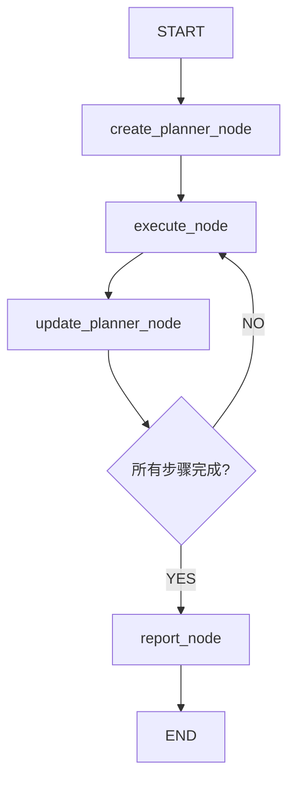

# LangGraph数据分析Agent详细教程

## 项目概述

这是一个基于LangGraph框架构建的智能数据分析报告生成Agent，能够自动分析CSV数据文件并生成专业的数据分析报告。该Agent采用多节点工作流设计，具备自主规划、执行和报告生成能力。

## 整体架构分析

### 1. 技术栈
- **核心框架**: LangGraph (用于构建多节点工作流)
- **大语言模型**: Qwen3-Coder (通过iflow API调用)
- **数据处理**: pandas, numpy, matplotlib, seaborn
- **状态管理**: Pydantic模型 + LangGraph MessagesState
- **工具系统**: LangChain Tools

### 2. 工作流架构



### 3. 核心组件
1. **状态管理** (state.py): 定义Agent的状态结构和数据模型
2. **节点实现** (nodes.py): 实现各个工作流节点的具体逻辑
3. **图构建** (graph.py): 构建和配置LangGraph工作流
4. **提示词** (prompts.py): 定义各节点的系统提示词
5. **工具集** (tools.py): 提供文件操作、代码执行等工具

## 详细文件分析

### 1. state.py - 状态管理模块

#### 1.1 核心类设计

**Step类** (第10-13行)
```python
class Step(BaseModel):
    title: str = ""
    description: str = ""
    status: Literal["pending", "completed"] = "pending"
```
- **设计目的**: 表示计划中的单个执行步骤
- **字段说明**:
  - `title`: 步骤标题，用于标识步骤
  - `description`: 步骤详细描述，包含具体执行内容
  - `status`: 步骤状态，只有"pending"和"completed"两种状态

**Plan类** (第16-19行)
```python
class Plan(BaseModel):
    goal: str = ""
    thought: str = ""
    steps: List[Step] = []
```
- **设计目的**: 表示完整的执行计划
- **字段说明**:
  - `goal`: 计划目标，描述最终要达到的目标
  - `thought`: 思考过程，记录制定计划时的思考逻辑
  - `steps`: 步骤列表，包含所有需要执行的步骤

**State类** (第21-25行)
```python
class State(MessagesState):
    user_message: str = ""
    plan: Plan
    observations: List = []
    final_report: str = ""
```
- **设计目的**: 继承LangGraph的MessagesState，定义Agent的完整状态
- **字段说明**:
  - `user_message`: 用户输入的消息
  - `plan`: 当前执行计划
  - `observations`: 执行过程中的观察结果
  - `final_report`: 最终生成的报告

#### 1.2 设计亮点
- 使用Pydantic进行数据验证和序列化
- 继承MessagesState获得消息历史管理能力
- 状态结构清晰，便于跟踪执行进度

### 2. graph.py - 图构建模块

#### 2.1 核心函数分析

**`_build_base_graph()`函数** (第12-21行)
```python
def _build_base_graph():
    """Build and return the base state graph with all nodes and edges."""
    builder = StateGraph(State)
    builder.add_edge(START, "create_planner")
    builder.add_node("create_planner", create_planner_node)
    builder.add_node("update_planner", update_planner_node)
    builder.add_node("execute", execute_node)
    builder.add_node("report", report_node)
    builder.add_edge("report", END)
    return builder
```
- **功能**: 构建基础的有向图结构
- **设计思路**: 
  - 使用StateGraph创建状态图
  - 添加四个核心节点：create_planner, update_planner, execute, report
  - 定义节点间的连接关系
- **关键点**: 只定义了固定的边，动态路由通过Command实现

**`build_graph_with_memory()`函数** (第24-28行)
```python
def build_graph_with_memory():
    """Build and return the agent workflow graph with memory."""
    memory = MemorySaver()
    builder = _build_base_graph()
    return builder.compile(checkpointer=memory)
```
- **功能**: 构建带内存的图，支持状态持久化
- **应用场景**: 需要保存执行历史或支持断点续传的场景

**`build_graph()`函数** (第31-35行)
```python
def build_graph():
    """Build and return the agent workflow graph without memory."""
    builder = _build_base_graph()
    return builder.compile()
```
- **功能**: 构建无内存的图，适合单次执行
- **性能**: 更轻量级，执行速度更快

#### 2.2 执行入口 (第38-46行)
```python
inputs = {"user_message": "对所给文档进行分析，生成分析报告，文档路径为'../data/train.csv'", 
          "plan": None,
          "observations": [], 
          "final_report": ""}

graph.invoke(inputs, {"recursion_limit":100})
```
- **功能**: 定义输入参数并启动图执行
- **参数说明**:
  - `user_message`: 用户任务描述
  - `plan`: 初始计划（为空）
  - `observations`: 初始观察结果（空列表）
  - `final_report`: 初始报告（空字符串）
- **配置**: 设置递归限制为100次，防止无限循环

### 3. nodes.py - 节点实现模块

#### 3.1 工具函数

**`extract_json()`函数** (第23-27行)
```python
def extract_json(text):
    if '```json' not in text:
        return text
    text = text.split('```json')[1].split('```')[0].strip()
    return text
```
- **功能**: 从包含JSON代码块的文本中提取JSON内容
- **使用场景**: 解析LLM返回的JSON格式响应

**`extract_answer()`函数** (第29-34行)
```python
def extract_answer(text):
    if '</think>' in text:
        answer = text.split("</think>")[-1]
        return answer.strip()
    return text
```
- **功能**: 从包含思考过程的文本中提取最终答案
- **设计思路**: 支持LLM的思考-回答模式

#### 3.2 核心节点实现

**`create_planner_node()`函数** (第36-44行)
```python
def create_planner_node(state: State):
    logger.info("***正在运行Create Planner node***")
    messages = [SystemMessage(content=PLAN_SYSTEM_PROMPT), 
                HumanMessage(content=PLAN_CREATE_PROMPT.format(user_message = state['user_message']))]
    response = llm.invoke(messages)
    response = response.model_dump_json(indent=4, exclude_none=True)
    response = json.loads(response)
    plan = json.loads(extract_json(extract_answer(response['content'])))
    state['messages'] += [AIMessage(content=json.dumps(plan, ensure_ascii=False))]
    return Command(goto="execute", update={"plan": plan})
```

**功能分析**:
1. **输入处理**: 接收用户消息，构建包含系统提示词和用户消息的对话
2. **LLM调用**: 使用Qwen3-Coder模型生成执行计划
3. **响应解析**: 多层解析LLM响应，提取JSON格式的计划
4. **状态更新**: 将生成的计划添加到消息历史中
5. **路由决策**: 使用Command跳转到execute节点

**设计亮点**:
- 使用Command进行动态路由，而不是固定边
- 支持中文JSON序列化（ensure_ascii=False）
- 完整的日志记录

**`update_planner_node()`函数** (第46-62行)
```python
def update_planner_node(state: State):
    logger.info("***正在运行Update Planner node***")
    plan = state['plan']
    goal = plan['goal']
    state['messages'].extend([SystemMessage(content=PLAN_SYSTEM_PROMPT), 
                             HumanMessage(content=UPDATE_PLAN_PROMPT.format(plan = plan, goal=goal))])
    messages = state['messages']
    while True:
        try:
            response = llm.invoke(messages)
            response = response.model_dump_json(indent=4, exclude_none=True)
            response = json.loads(response)
            plan = json.loads(extract_json(extract_answer(response['content'])))
            state['messages']+=[AIMessage(content=json.dumps(plan, ensure_ascii=False))]
            return Command(goto="execute", update={"plan": plan})
        except Exception as e:
            messages += [HumanMessage(content=f"json格式错误:{e}")]
```

**功能分析**:
1. **上下文构建**: 基于当前计划和目标构建更新提示
2. **错误处理**: 使用while循环和try-catch处理JSON解析错误
3. **迭代优化**: 如果JSON格式错误，将错误信息反馈给LLM重新生成
4. **状态同步**: 更新计划后跳转到execute节点

**设计亮点**:
- 鲁棒的错误处理机制
- 支持计划的动态调整
- 保持消息历史的连续性

**`execute_node()`函数** (第63-147行)

这是最复杂的节点，包含以下关键部分：

**步骤选择逻辑** (第72-77行):
```python
for i, step in enumerate(steps):
    status = step['status']
    if status == 'pending':
        current_step = step
        current_step_index = i
        break
```
- **功能**: 找到第一个待执行的步骤
- **设计思路**: 按顺序执行，跳过已完成的步骤

**工具调用处理** (第88-138行):
```python
while True:
    response = llm.bind_tools([create_file, str_replace, shell_exec]).invoke(messages)
    # ... 处理工具调用
    if response['tool_calls']:
        # 处理标准工具调用
    elif '<tool_call>' in response['content']:
        # 处理自定义工具调用格式
    else:    
        break
```

**功能分析**:
1. **工具绑定**: 将可用工具绑定到LLM
2. **双重工具调用支持**: 支持标准tool_calls和自定义<tool_call>标签
3. **参数验证**: 对str_replace工具进行必需参数验证
4. **结果记录**: 将工具执行结果添加到消息历史

**设计亮点**:
- 支持多种工具调用格式，提高兼容性
- 详细的参数验证和错误处理
- 完整的执行日志记录

**`report_node()`函数** (第151-173行)
```python
def report_node(state: State):
    logger.info("***正在运行report_node***")
    observations = state.get("observations")
    messages = observations + [SystemMessage(content=REPORT_SYSTEM_PROMPT)]
    
    while True:
        response = llm.bind_tools([create_file, shell_exec]).invoke(messages)
        # ... 处理工具调用
        if response['tool_calls']:    
            # 处理工具调用
        else:
            break
            
    return {"final_report": response['content']}
```

**功能分析**:
1. **上下文整合**: 基于所有观察结果生成报告
2. **工具支持**: 支持文件创建和命令执行工具
3. **迭代生成**: 支持多轮工具调用完善报告
4. **结果返回**: 返回最终报告内容

### 4. prompts.py - 提示词模块

#### 4.1 系统提示词设计

**PLAN_SYSTEM_PROMPT** (第1-26行)
- **语言设置**: 默认中文，支持用户指定语言
- **环境信息**: 详细描述Python环境和可用库
- **能力说明**: 明确文件操作和数据处理能力

**EXECUTE_SYSTEM_PROMPT** (第87-145行)
- **角色定义**: 自主AI代理
- **能力描述**: 数据处理、报告撰写、编程能力
- **规则体系**: 包含文件规则、编码规则、写作规则
- **循环机制**: 详细说明agent循环的工作原理

**REPORT_SYSTEM_PROMPT** (第179-201行)
- **专业定位**: 数据分析报告生成专家
- **风格指导**: 使用表格图表、避免描述全部数据
- **格式要求**: 包含分析背景、数据概述、可视化、建议结论
- **输出规范**: 生成markdown格式报告

#### 4.2 用户提示词设计

**PLAN_CREATE_PROMPT** (第28-62行)
- **JSON格式要求**: 严格的JSON输出规范
- **字段定义**: thought, goal, steps的详细说明
- **示例提供**: 完整的JSON输出示例
- **任务指导**: 强调步骤详细化和图表分步生成

**UPDATE_PLAN_PROMPT** (第64-84行)
- **更新原则**: 基于上下文结果更新计划
- **保持一致性**: 不改变目标，保持格式一致
- **状态管理**: 只重新规划未完成步骤

**EXECUTION_PROMPT** (第147-176行)
- **任务明确**: 基于用户消息和当前步骤选择工具
- **技术要求**: 必须使用Python，默认TOP10数据
- **规则详细**: 数据处理、代码、字体等具体要求

### 5. tools.py - 工具集模块

#### 5.1 文件操作工具

**`create_file()`函数** (第6-29行)
```python
@tool
def create_file(file_name, file_contents):
    try:
        file_path = os.path.join(os.getcwd(), file_name)
        os.makedirs(os.path.dirname(file_path), exist_ok=True)
        with open(file_path, 'w') as file:
            file.write(file_contents)
        return {"message": f"Successfully created file at {file_path}"}
    except Exception as e:
        return {"error": str(e)}
```

**功能特点**:
- 自动创建目录结构
- 完整的错误处理
- 标准化的返回格式

**`str_replace()`函数** (第32-53行)
```python
@tool
def str_replace(file_name, old_str, new_str):
    try:
        file_path = os.path.join(os.getcwd(), file_name)
        with open(file_path, "r") as file:
            content = file.read()
        new_content = content.replace(old_str, new_str, 1)
        with open(file_path, "w") as file:
            file.write(new_content)
        return {"message": "Successfully replaced..."}
    except Exception as e:
        return {"error": f"Error replacing...: {str(e)}"}
```

**功能特点**:
- 精确替换（只替换第一个匹配项）
- 文件读写操作
- 详细的错误信息

#### 5.2 系统交互工具

**`shell_exec()`函数** (第67-95行)
```python
@tool
def shell_exec(command: str) -> dict:
    try:
        result = subprocess.run(
            command,
            shell=True,          
            cwd=os.getcwd(),        
            capture_output=True,
            text=True,    
            check=False
        )
        return {"message":{"stdout": result.stdout,"stderr": result.stderr}}
    except Exception as e:
        return {"error":{"stderr": str(e)}}
```

**功能特点**:
- 安全的命令执行
- 捕获标准输出和错误输出
- 不抛出异常，返回错误信息

## 教学指引

### 第一阶段：理解整体架构

#### 1.1 学习目标
- 理解LangGraph的基本概念和工作原理
- 掌握多节点工作流的设计思路
- 了解Agent的状态管理机制

#### 1.2 学习步骤

**步骤1: 理解LangGraph核心概念**
```python
# 1. 状态图构建
builder = StateGraph(State)  # 创建状态图
builder.add_node("node_name", node_function)  # 添加节点
builder.add_edge(START, "node_name")  # 添加边
graph = builder.compile()  # 编译图

# 2. 状态管理
class State(MessagesState):
    # 定义状态字段
    pass

# 3. 节点函数
def node_function(state: State):
    # 处理状态
    return Command(goto="next_node", update={"field": value})
```

**步骤2: 分析工作流设计**
- 观察README.md中的Mermaid图
- 理解节点间的依赖关系
- 分析Command的动态路由机制

**步骤3: 理解状态流转**
- 从用户输入开始
- 跟踪状态在各个节点间的变化
- 理解observations的累积过程

### 第二阶段：深入节点实现

#### 2.1 学习目标
- 掌握各个节点的具体实现逻辑
- 理解LLM与工具的结合使用
- 学会错误处理和状态管理

#### 2.2 学习步骤

**步骤1: 分析create_planner_node**
```python
# 1. 理解提示词工程
messages = [SystemMessage(content=PLAN_SYSTEM_PROMPT), 
            HumanMessage(content=PLAN_CREATE_PROMPT.format(user_message = state['user_message']))]

# 2. 学习LLM调用和响应解析
response = llm.invoke(messages)
plan = json.loads(extract_json(extract_answer(response['content'])))

# 3. 理解Command的使用
return Command(goto="execute", update={"plan": plan})
```

**步骤2: 分析execute_node**
```python
# 1. 学习步骤选择逻辑
for i, step in enumerate(steps):
    if step['status'] == 'pending':
        current_step = step
        break

# 2. 理解工具绑定和调用
response = llm.bind_tools([create_file, str_replace, shell_exec]).invoke(messages)

# 3. 学习工具调用处理
if response['tool_calls']:
    for tool_call in response['tool_calls']:
        tool_name = tool_call['name']
        tool_args = tool_call['args']
        tool_result = tools[tool_name].invoke(tool_args)
```

**步骤3: 分析错误处理机制**
```python
# 1. JSON解析错误处理
try:
    plan = json.loads(extract_json(extract_answer(response['content'])))
    return Command(goto="execute", update={"plan": plan})
except Exception as e:
    messages += [HumanMessage(content=f"json格式错误:{e}")]

# 2. 工具参数验证
if tool_name == "str_replace":
    required_params = ['file_name', 'old_str', 'new_str']
    missing_params = [param for param in required_params if param not in tool_args]
    if missing_params:
        tool_result = {"error": f"缺少必需参数: {missing_params}"}
```

### 第三阶段：掌握工具系统

#### 3.1 学习目标
- 理解LangChain工具系统
- 掌握自定义工具的实现
- 学会工具与LLM的集成

#### 3.2 学习步骤

**步骤1: 理解@tool装饰器**
```python
@tool
def create_file(file_name, file_contents):
    """
    Create a new file with the provided contents at a given path in the workspace.
    
    args:
        file_name (str): Name to the file to be created
        file_contents (str): The content to write to the file
    """
    # 工具实现
    pass
```

**步骤2: 学习工具绑定**
```python
# 绑定工具到LLM
response = llm.bind_tools([create_file, str_replace, shell_exec]).invoke(messages)

# 处理工具调用
if response['tool_calls']:
    for tool_call in response['tool_calls']:
        tool_name = tool_call['name']
        tool_args = tool_call['args']
        tool_result = tools[tool_name].invoke(tool_args)
```

**步骤3: 理解工具消息格式**
```python
# 将工具结果添加到消息历史
messages += [ToolMessage(content=f"tool_name:{tool_name},tool_args:{tool_args}\ntool_result:{tool_result}", 
                        tool_call_id=tool_call['id'])]
```

### 第四阶段：提示词工程

#### 4.1 学习目标
- 掌握系统提示词的设计原则
- 理解不同场景下的提示词策略
- 学会提示词的模块化管理

#### 4.2 学习步骤

**步骤1: 分析系统提示词结构**
```python
PLAN_SYSTEM_PROMPT = f"""
You are an intelligent agent with autonomous planning capabilities...

<language_settings>
- Default working language: **Chinese**
- Use the language specified by user in messages as the working language when explicitly provided
- All thinking and responses must be in the working language
</language_settings>

<execute_environment>
System Information
- Base Environment: Python 3.11 + Ubuntu Linux (minimal version)
- Installed Libraries: pandas, openpyxl, numpy, scipy, matplotlib, seaborn
...
</execute_environment>
"""
```

**步骤2: 理解用户提示词设计**
```python
PLAN_CREATE_PROMPT = '''
You are now creating a plan. Based on the user's message, you need to generate the plan's goal and provide steps for the executor to follow.

Return format requirements are as follows:
- Return in JSON format, must comply with JSON standards...
- JSON fields are as follows:
    - thought: string, required, response to user's message...
    - steps: array, each step contains title and description...
    - goal: string, plan goal generated based on the context...

EXAMPLE JSON OUTPUT:
{{
   "thought": ""
   "goal": "",
   "steps": [...]
}}

Create a plan according to the following requirements:
- Provide as much detail as possible for each step...
- Break down complex steps into multiple sub-steps...
- If multiple charts need to be drawn, draw them step by step...

User message:
{user_message}/no_think
'''
```

**步骤3: 学习提示词模板化**
```python
# 使用format方法进行变量替换
HumanMessage(content=PLAN_CREATE_PROMPT.format(user_message = state['user_message']))
HumanMessage(content=EXECUTION_PROMPT.format(user_message=state['user_message'], step=current_step['description']))
```

### 第五阶段：实践和扩展

#### 5.1 学习目标
- 能够独立运行和调试Agent
- 学会添加新的工具和节点
- 掌握性能优化和错误处理

#### 5.2 实践步骤

**步骤1: 环境搭建**
```bash
# 1. 安装依赖
pip install -r requirements.txt

# 2. 配置API密钥
# 修改nodes.py中的API配置
llm = ChatOpenAI(model="Qwen3-Coder", temperature=0.2, 
                 base_url='https://apis.iflow.cn/v1', 
                 api_key='your-api-key')

# 3. 准备数据文件
# 将CSV文件放在data目录下
```

**步骤2: 运行和调试**
```python
# 1. 直接运行
python graph.py

# 2. 添加调试日志
import logging
logging.basicConfig(level=logging.INFO)

# 3. 单步调试
# 在关键位置添加断点或print语句
```

**步骤3: 扩展功能**
```python
# 1. 添加新工具
@tool
def new_tool(param1: str, param2: int):
    """新工具的描述"""
    # 工具实现
    return {"result": "success"}

# 2. 添加新节点
def new_node(state: State):
    """新节点的实现"""
    # 节点逻辑
    return Command(goto="next_node", update={"field": value})

# 3. 修改图结构
builder.add_node("new_node", new_node)
builder.add_edge("execute", "new_node")
```

## 常见问题和解决方案

### 1. JSON解析错误
**问题**: LLM返回的JSON格式不正确
**解决方案**: 
- 在update_planner_node中实现错误重试机制
- 使用更严格的JSON格式要求
- 添加JSON验证步骤

### 2. 工具调用失败
**问题**: 工具参数不正确或执行失败
**解决方案**:
- 实现参数验证机制
- 添加详细的错误日志
- 提供工具使用示例

### 3. 状态管理问题
**问题**: 状态更新不正确或丢失
**解决方案**:
- 使用Command的update参数正确更新状态
- 保持消息历史的连续性
- 定期检查状态一致性

### 4. 性能优化
**问题**: Agent执行速度慢
**解决方案**:
- 优化提示词长度
- 减少不必要的工具调用
- 使用缓存机制

## 进阶学习建议

### 1. 深入学习LangGraph
- 学习更复杂的图结构设计
- 掌握条件路由和循环控制
- 了解内存管理和状态持久化

### 2. 扩展工具系统
- 学习更多LangChain工具
- 实现自定义工具
- 集成外部API和数据库

### 3. 优化提示词工程
- 学习few-shot learning
- 掌握chain-of-thought prompting
- 实现动态提示词生成

### 4. 监控和调试
- 实现执行监控
- 添加性能指标
- 建立错误报告机制

## 总结

这个LangGraph数据分析Agent项目展示了现代AI Agent开发的最佳实践：

1. **模块化设计**: 清晰的文件结构和职责分离
2. **状态管理**: 使用Pydantic和MessagesState进行状态管理
3. **工具集成**: 灵活的工具系统和LLM集成
4. **错误处理**: 完善的错误处理和重试机制
5. **提示词工程**: 结构化的提示词设计和管理

通过学习这个项目，您将掌握：
- LangGraph框架的核心概念和使用方法
- 多节点工作流的设计和实现
- LLM与工具系统的集成
- 提示词工程的最佳实践
- Agent开发的全流程方法

建议按照教程的五个阶段循序渐进地学习，每个阶段都要进行充分的实践和实验，这样才能真正掌握Agent开发的核心技能。
